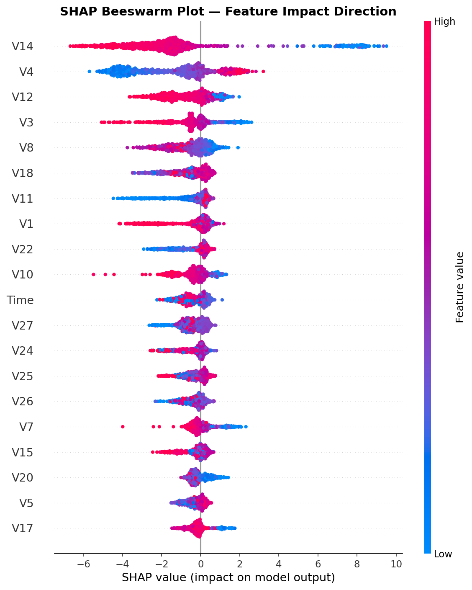
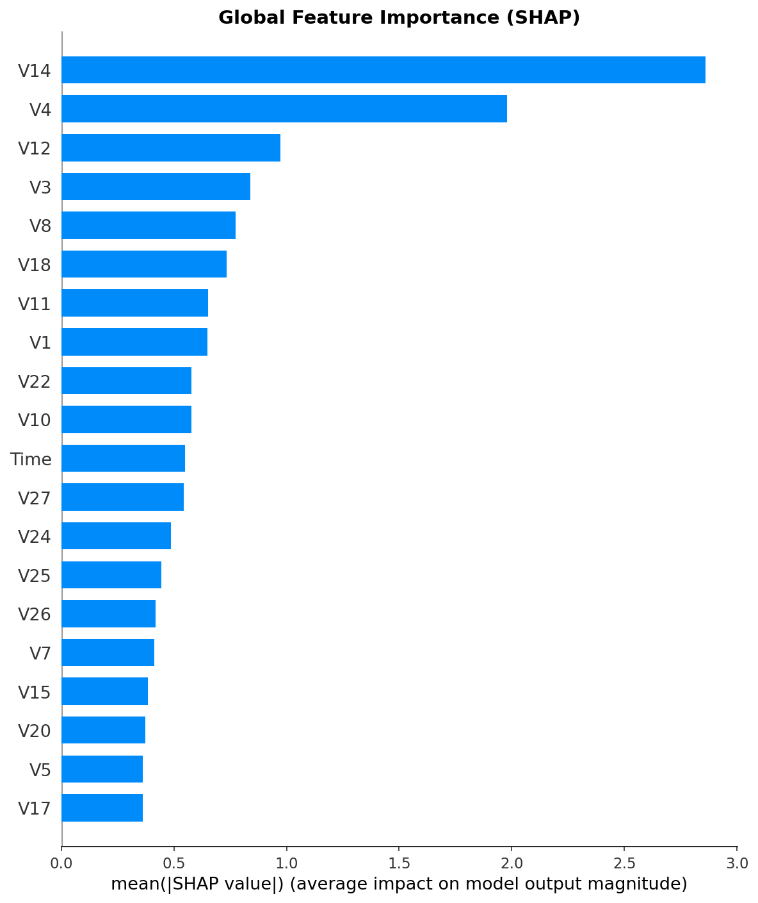
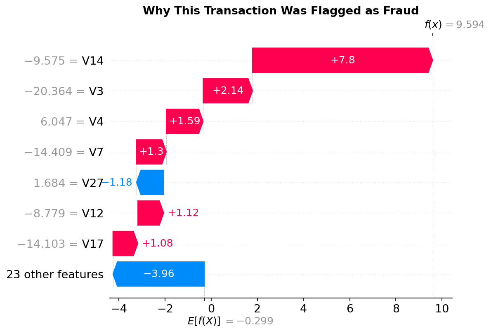

# Credit Card Fraud Detection

A complete end-to-end machine learning project for detecting fraudulent credit card transactions. This project covers the full pipeline — from exploratory data analysis and preprocessing to model training, evaluation, and SHAP explainability.

---

## Problem Statement

Credit card fraud is a serious financial problem. Detecting fraudulent transactions is challenging because:
- Fraud accounts for only **0.173%** of all transactions — extreme class imbalance
- A model predicting everything as genuine would score **99.83% accuracy** but catch zero fraud
- Standard accuracy is a misleading metric — **Precision, Recall, and PR-AUC** are used instead

---

## Dataset

| Property | Value |
|----------|-------|
| Source | [Kaggle — Credit Card Fraud Detection (ULB)](https://www.kaggle.com/datasets/mlg-ulb/creditcardfraud) |
| Total Transactions | 284,807 |
| Fraudulent Transactions | 492 (0.173%) |
| Genuine Transactions | 284,315 (99.827%) |
| Features | 31 (Time, V1–V28, Amount, Class) |
| Time Period | 2 days of European cardholder transactions |

**Feature Notes:**
- `V1` to `V28` — PCA-transformed features (original features hidden for privacy)
- `Time` — seconds elapsed since the first transaction
- `Amount` — transaction amount in euros
- `Class` — target variable (0 = Genuine, 1 = Fraud)

---

## Project Structure

```
credit-card-fraud-detection/
│
├── notebooks/
│   ├── 01_eda.ipynb                ← Exploratory Data Analysis
│   ├── 02_preprocessing.ipynb     ← Scaling, Splitting, SMOTE
│   ├── 03_modeling.ipynb           ← Train 3 ML models
│   ├── 04_evaluation.ipynb         ← Metrics, Confusion Matrix, PR Curve
│   └── 05_shap.ipynb               ← SHAP Explainability
│
├── data/
│   ├── creditcard.csv              ← Download from Kaggle (not included)
│   └── processed/
│       ├── X_train.csv             ← Generated by 02_preprocessing.ipynb
│       ├── Y_train.csv             ← Generated by 02_preprocessing.ipynb
│       ├── X_test.csv              ← Generated by 02_preprocessing.ipynb
│       └── Y_test.csv              ← Generated by 02_preprocessing.ipynb
│
├── models/
│   ├── logistic_regression.pkl
│   ├── random_forest.pkl
│   └── xgboost.pkl
│
├── images/
│   ├── shap_importance.png
│   ├── shap_beeswarm.png
│   └── shap_waterfall_fraud.png
│
├── requirements.txt
├── .gitignore
└── README.md
```

> **Note:** The raw dataset (`creditcard.csv`) and processed data files are not included due to file size. Download the dataset from Kaggle and place it in a `data/` folder before running the notebooks.

---

## Methodology

### Notebook 1 — Exploratory Data Analysis

Key insights discovered:

**Class Imbalance**
- Only 492 fraud transactions out of 284,807 total (0.173%)
- This makes accuracy a useless metric — a dumb model predicting all transactions as genuine gets 99.83% accuracy but catches zero fraud

**Amount Analysis**
| | Genuine | Fraud |
|-|---------|-------|
| Mean | €88.29 | €122.21 |
| Median | €22.00 | €9.25 |
| Max | €25,691.16 | €2,125.87 |

- Fraud median (€9.25) is much lower than genuine median (€22.00)
- Most fraud happens at small amounts — fraudsters avoid detection by staying under automatic large-transaction flags
- Occasionally fraudsters make one large transaction, which pulls the mean up

**Time Analysis**
- Dataset covers exactly 48 hours (2 days)
- Genuine transactions follow human behavior — peak during the day, drop at night
- Fraud transactions are random across all hours — no sleep pattern, suggesting automated bot activity

**Correlation Analysis**
- V17, V14, V12, V10 show the strongest negative correlation with fraud (associated with genuine)
- V11, V4, V2 show positive correlation (associated with fraud)
- No single feature is strong enough alone — model must combine all features

---

### Notebook 2 — Preprocessing

**Scaling**
- `Amount` and `Time` scaled using `StandardScaler` (V1–V28 are already PCA-scaled)
- After scaling: mean = 0, std = 1 for both features

**Train/Test Split**
- 75% training, 25% testing
- `stratify=y` used to preserve the 0.173% fraud ratio in both sets

| Split | Rows | Fraud | Genuine |
|-------|------|-------|---------|
| Train | 213,605 | 369 | 213,236 |
| Test | 71,202 | 123 | 71,079 |

**SMOTE — Handling Class Imbalance**

SMOTE (Synthetic Minority Oversampling Technique) was applied **only on training data** to avoid data leakage.

| | Before SMOTE | After SMOTE |
|-|-------------|------------|
| Genuine | 213,236 | 213,236 |
| Fraud | 369 | 213,236 |
| Total | 213,605 | 426,472 |

The test set was kept original and imbalanced — evaluation must reflect real-world conditions.

---

### Notebook 3 — Model Training

Three models were trained on SMOTE-balanced training data:

| Model | Description |
|-------|-------------|
| Logistic Regression | Simple interpretable baseline |
| Random Forest | Ensemble of 100 decision trees |
| XGBoost | Gradient boosting, 100 rounds |

All models saved using `joblib` for efficient loading in evaluation and deployment.

---

### Notebook 4 — Evaluation

**Why not Accuracy?**
The test set has 123 fraud vs 71,079 genuine transactions. A model predicting everything as genuine scores 99.83% accuracy but catches zero fraud — completely useless.

**Metrics used:** Precision, Recall, F1-Score, PR-AUC, ROC-AUC, Confusion Matrix

**Results:**

| Model | Precision | Recall | F1-Score | PR-AUC | ROC-AUC |
|-------|-----------|--------|----------|--------|---------|
| Logistic Regression | 0.06 | 0.89 | 0.11 | 0.7111 | 0.9720 |
| Random Forest | 0.85 | 0.80 | 0.83 | 0.8515 | 0.9740 |
| **XGBoost** | **0.73** | **0.82** | **0.77** | **0.8487** | **0.9812** |

**Confusion Matrix Results:**

| Model | Fraud Caught (TP) | Fraud Missed (FN) | False Alarms (FP) |
|-------|------------------|------------------|------------------|
| Logistic Regression | 109 | 14 | 1,712 |
| Random Forest | 99 | 24 | 17 |
| **XGBoost** | **101** | **22** | **37** |

**Model Selection by Business Priority:**

| Priority | Best Model |
|----------|-----------|
| Minimize false alarms | Random Forest (only 17 FP) |
| Catch maximum fraud | Logistic Regression (109 caught) |
| Best overall balance | XGBoost (101 caught, only 37 FP) |
| Best discrimination | XGBoost (ROC-AUC 0.9812) |

**Final Decision → XGBoost selected for deployment**
- Catches 101 fraud vs Random Forest's 99
- Misses only 22 fraud vs Random Forest's 24
- In fraud detection, missing real fraud is more costly than extra false alarms
- Random Forest is recommended when minimizing false alarms is the business priority

**Precision-Recall Curve:**



- Random Forest maintains highest precision the longest
- XGBoost is almost identical to Random Forest
- All models collapse after recall 0.85 — optimal threshold is around 0.80 recall

---

### Notebook 5 — SHAP Explainability

SHAP (SHapley Additive exPlanations) was used to explain **why** the XGBoost model makes each prediction — not just what it predicts.

**Sampling Strategy:**
Initial random sampling (1000 transactions) contained only 3 fraud cases — too sparse for meaningful fraud pattern visualization. Fixed by using stratified sampling: all 123 fraud cases + 877 random genuine cases = 1000 total sample with guaranteed fraud representation.

**Global Feature Importance:**



Top 3 most influential features: **V14, V4, V12**

**SHAP Beeswarm Plot — Direction of Impact:**


| Feature | Pattern | Meaning |
|---------|---------|---------|
| V14 | Low values → right (fraud) | Low V14 pushes toward fraud |
| V4 | High values → right (fraud) | High V4 pushes toward fraud |
| V12, V3 | Low values → right (fraud) | Low values push toward fraud |

**Local Explanation — One Specific Fraud Transaction:**



- V14 had the strongest impact — its very low value (V14 = -9.575) pushed the prediction strongly toward fraud
- The base value started near 0 but feature contributions pushed the final output f(x) close to 1.0 — confirming high fraud probability
- The model has specific, traceable reasons for each decision — not a black box

---

## Key Learnings

1. **Class imbalance** is the core challenge in fraud detection — SMOTE on training data only is the correct approach
2. **PR-AUC** is the right metric for imbalanced classification — not accuracy
3. **Model selection is a business decision** — XGBoost and Random Forest are nearly equal; the choice depends on whether you prioritize catching more fraud or reducing false alarms
4. **SHAP explainability** transforms a black-box model into a transparent, auditable system — essential for real-world fraud detection compliance
5. **Stratified sampling for SHAP** is critical — random sampling on imbalanced data gives almost no fraud examples to explain

---

## How to Run

**1. Clone the repository:**
```bash
git clone https://github.com/parthshelar-dev/credit-card-fraud-detection.git
cd credit-card-fraud-detection
```

**2. Install dependencies:**
```bash
pip install -r requirements.txt
```

**3. Download the dataset:**
- Go to [Kaggle Dataset](https://www.kaggle.com/datasets/mlg-ulb/creditcardfraud)
- Download `creditcard.csv`
- Place it inside the `data/` folder

**4. Run notebooks in order:**

| Step | Notebook | What it does |
|------|----------|-------------|
| 1 | `01_eda.ipynb` | Explore the dataset |
| 2 | `02_preprocessing.ipynb` | Creates processed files in `data/processed/` |
| 3 | `03_modeling.ipynb` | Trains and saves 3 models |
| 4 | `04_evaluation.ipynb` | Evaluates all models |
| 5 | `05_shap.ipynb` | SHAP explainability |

> **Important:** Run notebooks in order. `02_preprocessing.ipynb` 
> automatically generates all processed data files needed 
> for subsequent notebooks.

---

## Requirements

```
pandas
numpy
matplotlib
seaborn
scikit-learn
imbalanced-learn
xgboost
shap
joblib
jupyter
```

---

## Future Improvements

- [ ] Streamlit web app — interactive fraud detection dashboard with SHAP explanations
- [ ] Threshold tuning — cost-sensitive analysis to optimize the fraud/false-alarm tradeoff
- [ ] Hyperparameter tuning — Optuna-based tuning for XGBoost to improve PR-AUC
- [ ] Isolation Forest — unsupervised anomaly detection comparison
- [ ] Model card — document limitations, bias checks, and intended use

---

## Author

**Parth Shelar**
- GitHub: [github.com/parthshelar-dev](https://github.com/parthshelar-dev)
- LinkedIn: [linkedin.com/in/parth-shelar](https://linkedin.com/in/parth-shelar)
